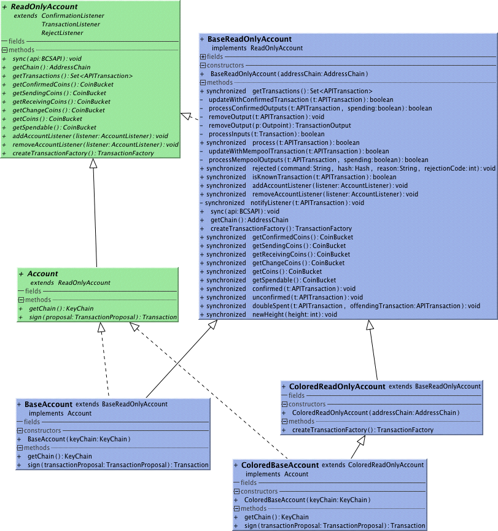

##Accounts
Accounts give you a snapshot or real-time view of a holdings determined by an Address or Key Chain. 
They also act as a factory for the appropriate Transaction Factory.
##Use
Instantiate with a key chain. E.g. see holdings on Satoshi's first address:
```
account = new BaseReadOnlyAccount(new AddressListChain(UIAddress.fromSatoshiStyle("1A1zP1eP5QGefi2DMPTfTL5SLmv7DivfNa").getAddress()));
```
Get a snapshot of account content from the server. See BCSAPI for api.
```
account.sync(api);
```
Optionally subscribe to incoming transactions for real-time changing view.
```
api.registerTransactionListener(account);
```
Optionally subscribe to real-time confirmations in blocks. You only need one instance of the confirmation manager for all your accounts.
```
ConfirmationManager confirmationManager = new ConfirmationManager();
confirmationManager.init(api, 10);
confirmationManager.addConfirmationListener(account);
```
Query the Account content with getXXXCoins() where XXX is one of
```
long holding = account.getCoins().getTotal();
```

* Receiving - Coins on the way to the Account not yet in a block
* Confirmed - Coins received and confirmed in a block
* Change - Coins on the way back to the account. This is the change of some previous spend not yet in a block.
* Sending - Coins moving away from the Account but not yet confirmed in a block.
* Coins - All coins the account owns, that is Receiving + Confirmed + Change
* Spendable - Coins ready to spend, that is Confirmed + Change

Obtain a Transaction Factory to create transactions that spend the account.
```
TransactionFactory transactionfactory = account.createTransanctionFactory();
```
