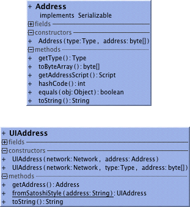

##Address
An Address is a helper to recognize ledger entries that can be modified with a certain key. 
There are three flavors of Addresses:
```
public enum Type {
    COMMON, P2SH, P2KEY
}
```
Outputs on common addresses can be spent with a single key. Outputs on pay-to-script-hash (P2SH) might need any number of keys. A legacy format of single key address is P2KEY.
##Address rendering
Addresses are often displayed to user in a Bitcoin specific Base58 format, that also depends on the network. Use the UIAddress class for that purpose.
