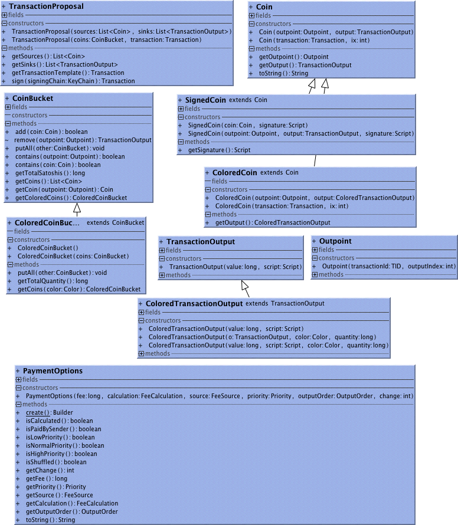

##Advanced Use	
Accounts sort Coins into CoinBuckets for confirmed, receiving, change, sending.
TransactionFactory creates TransactionProposal that is a list of Coins as sources and a List of TransactionOutputs as sinks. The factory's subtle features are controlled by PaymentOptions.
A TransactionProposal signed with a KeyChain can deliver a Transaction. A TransactionProposal might be partialSigned by several key chains before extracting the final transaction.