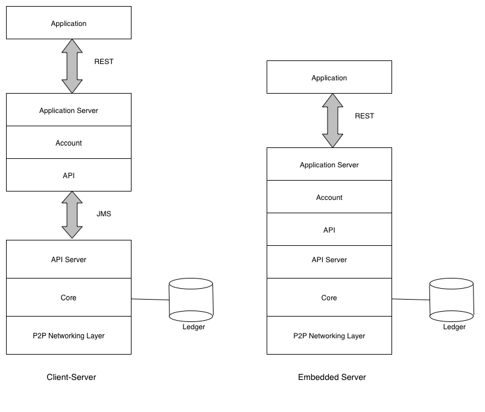

The below diagram shows alternate configurations of a Hyperledger node serving an application. 
The Client-Server configuration allows fail-over and load balancing between several in-house ledger servers. 
A network is made up of several nodes running on behalf of customer on their premises connected only through a P2P protocol. 
Each node maintains its own copy of the distributed ledger.

## P2P Networking Layer
Communicates with other nodes in a peer-to-peer fashion. There is no delivery guarantee of messages and some nodes may attempt to cheat. This layer is implemented in Scala with the Akka framework. The code is in server/network.
##Core
Maintains ledger database that is guaranteed to match with the majority opinion of the network. This layer is implemented in Java, also using native (C++) libraries for storage (LevelDB) and transaction validation (libconsensus). The code is in server/core/core
##API Server
Receives API requests and translates them to queries to the ledger. The code is Java in sever/core/server
##API
Low level, block explorer like, API translator to server requests. The code is Java in client/api
##Account
Higher level API. Ledger view by accounts defined through keys and master keys, transaction factory, colored tokens. The code is Java in client/account
##Application Server
Implementation of a concrete use case. Mapping business concept to tokens. The code will be in other repos. REST or websocket service supported by code in client/dropwizard
##Application
User Interface