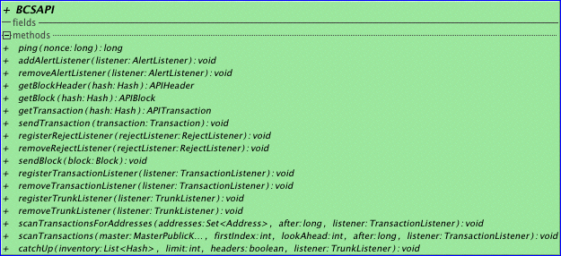

BCSAPI (Blockchain Client Server API) is the low level interface to the Hyperledger server.
It features simple functions to retrieve Header, Block, Transaction and listen to network events. 
The interface is hardly suitable for anything more intelligent than a block explorer. Use the Account Module rather for applications.
Most Account Module constructs need a BCSAPI instance for initialization. How you get the BCSAPI instance depends on your Configuration.
