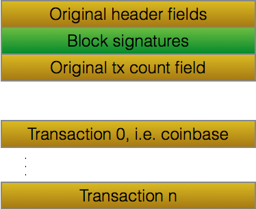
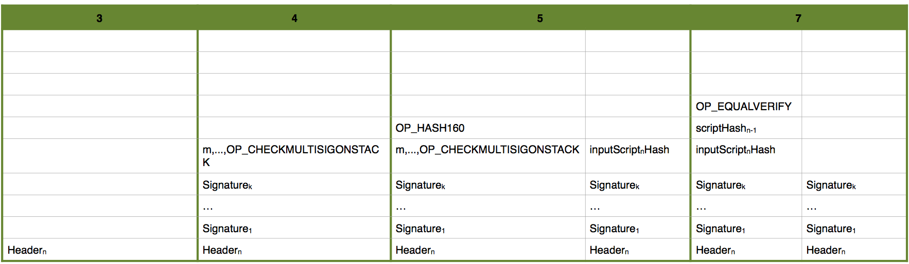
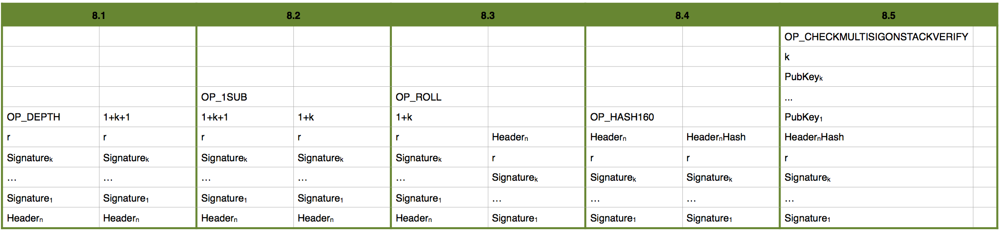

# Block signature
## Goal

Add extra signatures to the block to prove who created the given block and who can create the next one. This also allows transaction chaining.

This document uses _signature_ in plural, but adding only a single signature is fine too.

## Incompatibility

This adds an extra field to the header and thus is not compatible with the block chain and validation of the core implementation.

# Solution

The extra signatures are added as the last element of the header (depicted in green). The signatures are deterministic signatures and are included into the proof-of-work calculation.

## Block signatures

Block signatures are implemented as bitcoin scripts (similarly to transaction inputs and outputs). So there are pairs of input script and script hash fields. The script hash of blockn-1 determines what script is accepted in blockn, i.e the miner of the next block will have to provide an inputScriptn that satisfies scriptHashn-1.

An example input script supporting multisig case is depicted below. If k and m are both 1 then it is a single sig case. Note that each cell is a single item:

The OP_CHECKMULTISIGONSTACK and OP_CHECKMULTISIGONSTACKVERIFY are new operations expecting the following arguments on the stack from the top to the bottom:

 * number of public keys and signatures
 * public keys in growing order from the bottom
 * hash of the data to be checked, which in our case is the hash of the original header
 * the required minimum number of matching signature/public key pairs out of k
 * signatures in the order that they correspond to the public key with the same index, or a zero byte placeholder if the given signature is not provided

## Validation

Header validation now has an extra step by validating the new data. If any of the steps fail, the entire validation will fail and the header and block will be rejected. The evaluation steps below start from an empty stack.

1. Check proof-of-work
2. Check that inputScriptn has push operations only
3. Push the original header (80 bytes) to the stack
4. Execute inputScriptn, i.e. populate the stack
5. Execute OP_HASH160  
6. Push the scriptHashn-1
7. Execute OP_EQUALVERIFY
8. Execute the inputScriptn, i.e. add items from it to the stack
9. Check if it leaves a single true value on the stack
    
Here are the stack contents during a successfull validation executing the above steps. Only those steps are shown which change the stack. If column at the left has an operation at the top then the next column shows the result.
 

