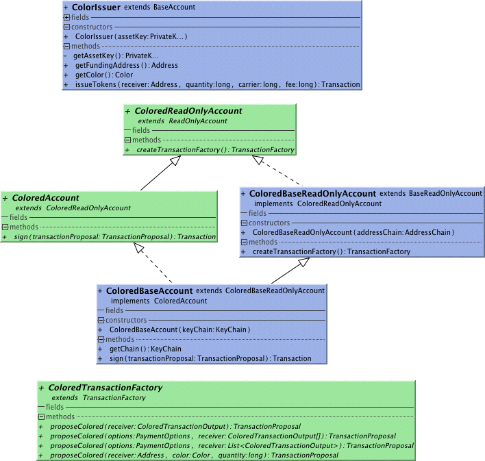

##ColorIssuer
Instantiate with a private key that will control the asset and issue tokens to any receiver Address with issueTokens()
CAUTION: Be sure to use a ColoredReadOnlyAccount or ColoredAccount to observe or maintain the address you sent the colored token as
regular Accounts will not respect the colors and likely burn them.
###Basic Use
```
// assuming there are funds for tokens on the address controlled by the key
ColorIssuer colorIssuer = new ColorIssuer(key);
Color color = colorIssuer.getColor();
PrivateKey receiverKey = PrivateKey.createNew();
// issue 100 units carried by 50000 satoshis
Transaction issuing = colorIssuer.issueTokens(receiverKey.getAddress(), 100, 50000, 
        BaseTransactionFactory.MINIMUM_FEE);
api.sendTransaction(issuing);
// now transfer 50 the new color with a ColoredAccount to next owner
ColoredAccount coloredAccount = new ColoredBaseAccount(new KeyListChain(receiverKey));
PrivateKey nextOwner = PrivateKey.createNew();
Transaction transfer = coloredAccount.createTransactionFactory()
        .proposeColored(nextOwner.getAddress(), color, 50).sign(coloredAccount.getChain());
api.sendTransaction(transfer);
```
