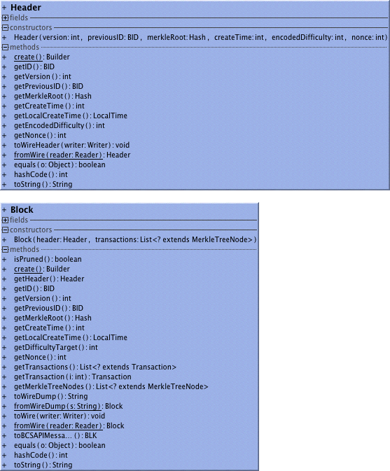

##Header
A Header chains blocks together by pointing to previous header and substantiates the proof of work. It contains a merkle tree root of the transactions in the corresponding block.
##Block
A Block is a Header plus the list of Transactions in the block. 
