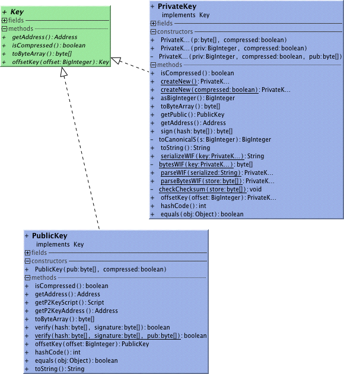

##Key
A public or private key represented by an interface. A key has a corresponding Address.
Legacy transactions used uncompressed representation of public keys.
##Private Key
A key capable of signing a transaction spending a corresponding address.
Construct it random with createNew or parse in WIF serialization.
##Public Key
A key capable of checking signature on a transaction spending a corresponding address.

