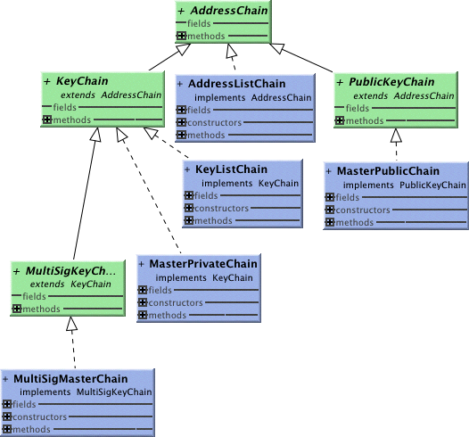

Address and Key Chains define the boundaries of an Account. In case of an AddressChain or a PublicKeyChain access is read only, that is you can retrieve associated ledger entries but can not create transactions that would modify them.
##AddressListChain
The simplest read-only chain, you create it by providing a list of adresses. 
##MasterPublicChain
An address list defined by a master public key. 
##KeyListChain
An account for which we have a list of private keys. 
##MasterPrivateChain
Access to an account defined by a new master private Key
##MultiSigMasterChain
Access to an account with n of m signatures of corresponding master keys.
