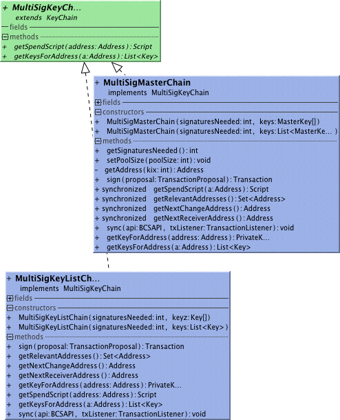

##Combine!
Account and TransactionFactory both plain and Colored work also with Multi-Sig.
###Example Use
Using a 2-of-2 address
```
PrivateKey p1 = PrivateKey.createNew();
PrivateKey p2 = PrivateKey.createNew();

MultiSigKeyChain multiChain = new MultiSigKeyListChain(2, p1, p2);
Account multiAccount = new BaseAccount(multiChain);
Transaction send = multiAccount.createTransactionFactory().propose(receiver, 1000000).sign(multiChain);
or using a pool of 2-of-2 addresses generated by master keys
MasterPrivateKey m1 = MasterPrivateKey.createNew();
MasterPrivateKey m2 = MasterPrivateKey.createNew();

MultiSigKeyChain multiChain = new MultiSigMasterChain(2, m1, m2);
Account multiAccount = new BaseAccount(multiChain);
Transaction send = multiAccount.createTransactionFactory().propose(receiver, 1000000).sign(multiChain);
```