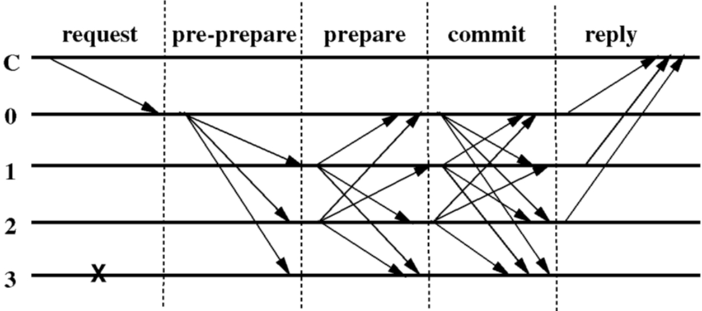

# PBFT Implementation notes
A node is started with a configuration of an ordered list containing all the nodes (including itself) that make up the pool. A node is defined at a minimum by public key and network endpoint for message sending. One node is defined as the primary, the rest are replicas. Primary starts at the 1st node in the list, and proceeds in a round-robin fashion based on view changes described below.
Clients also have a copy of the node list. They can only send messages to the current primary. They can request the current primary from any node, but sending a transaction to a replica should return an error with the current primary.
The primary collects transactions into blocks which are ordered as per the description below. The primary orders a number of blocks in a given period. This period is known as a “view”.
```
View	1	1	1	1	2	2	2	2	3	3
Block	1	2	3	4	5	6	7	8	9	10
```

##Normal Case Operation
The state of each replica includes the current UTXOs, a local-blockchain containing blocks the replica has accepted, and an integer denoting the replica's current view.
When the primary, p, receives a client transaction, t, it keeps t in mempool until some block criteria is reached — let's say X transactions or Y timeout (configurable). When the block is ready it starts a three-phase protocol to atomically multicast the block to the replicas.
The three phases are pre-prepare, prepare, and commit.

##Pre-prepare Phase
In the pre-prepare phase, the primary assigns a sequence number to the block, multicasts the block to all the backups, and appends the block to its local-blockchain. The block has the form: ((viewSeq, blockHeight, txnsMklRoot)sig, transactions), where viewSeq is the sequence number of the view, blockHeight is the sequence number of the block (can roll per view or can keep increasing), and txnsMklRoot is the Merkle root of the transaction hashes. The header can contain more information, but must be signed.
A replica accepts a block provided:
- the transactions are all formatted correctly and have valid signatures (note: can't check UTXO validity here);
- the header is signed correctly;
- the Merkle root is correct for the transaction hashes;
- it is in view viewSeq;
- it has not accepted a block for viewSeq and blockHeight containing a different Merkle root.

##Prepare Phase
If backup i accepts the block, it enters the prepare phase by multicasting a (PREPARE, viewSeq, blockHeight, txnsMklRoot, i)sig certificate to all other replicas and adds both block and certificate to its log. Otherwise, it does nothing.
A replica (including the primary) accepts prepare certificates and adds them to its local-blockchain if:
their signatures are correct;
their view number equals the replica's current view.
The predicate prepared(transactions, viewSeq, blockHeight, i) is true if and only if replica i has inserted in its local-blockchain:
a block for transactions in viewSeq with blockHeight;
2f prepare certificates from different backups that have the same viewSeq, blockHeight, and Merkle root as the block.

##Commit Phase
Replica i multicasts a (COMMIT, viewSeq, blockHeight, txnsMklRoot, i)sig certificate to the other replicas when prepared(transactions, viewSeq, blockHeight, i) becomes true. This starts the commit phase. Replicas accept commit certificates and insert them in their local-blockchain if:
they are properly signed;
the view number in the certificate is equal to the replica's current view.
committed-local(transactions, viewSeq, blockHeight, i) is true if and only if:
prepared(transactions, viewSeq, blockHeight, i) is true and
i has accepted 2f+1 commit certificates (can including its own) from different replicas that have the same viewSeq, blockHeight, and Merkle root as the block
Each replica updates the UTXOs as given in the transactions after committed-local(transactions, viewSeq, blockHeight, i) is true and it has executed block n-1. It can then return the fact that transaction has been included to the client.
This figure shows the operation of the algorithm in the normal case of no primary faults. Replica 0 is the primary, replica 3 is faulty, and C is the client.


##Recovery
Any node can be queried for its highest executed block, the current view information, and to provide a portion of its local-blockchain. Clients can use this to monitor the status of the system. Nodes should regularly query the rest of the system (and certainly when they recover from a fault) to see if they have fallen behind, and if so should request all blocks with certificates from their highest executed block to the highest executed by the cluster. (Note that it can still log incoming messages asynchronously to avoid being perpetually behind.)

##View Changes
The view-change protocol provides liveness by allowing the system to make progress when the primary fails. View changes are triggered by timeouts. A backup is waiting for a block if it received a valid block and has not executed it.
A backup:
- starts a timer when it receives a block and the timer is not already running;
- stops the timer when it is no longer waiting to execute the block, but;
- restarts it if at that point it is waiting to execute some other block.
If the timer of backup i expires during view v, the backup starts a view change to move the system to view v+1. It stops accepting messages (other than view-change, and new-view messages) and multicasts a (VIEW-CHANGE, v+1, blockHeight, C, i)sig message to all replicas, where:
- blockHeight is the sequence number of the highest block b that i executed;
- C is a set of 2f+1 valid signed commit certificates for b;
It also restarts its timer. If the timer expires before it receives a valid NEW-VIEW message (see below) or before it executes a block in the new view then it starts the view change process again for v+2 and resets the timer to timeout * 2 (and if that expires, v+3 and timeout * 3 and so on).
If i receives f+1 valid VIEW-CHANGE messages from other backups and its timer has not expired it should start the VIEW-CHANGE phase for the smallest viewSeq in the set of VIEW-CHANGE messages.
When the primary p of view v+1 receives 2f valid view-change messages for view v+1 from other replicas it should follow the recovery protocol as specified above to ensure it is up to date with the highest executed block of the system.
Then it multicasts a (NEW-VIEW, v+1, V, B)sig message to all other replicas, where:
- V is a set of all the valid view-change messages received by the primary, plus the view-change message for v+1 the primary sent (or would have sent), and;
- B is a list of blocks covering the range from the lowest executed blockHeight in V to the highest. This ensures all replicas are up to date at a view-change.
A backup accepts a new-view message for view v+1 if:
- it is signed properly;
- if the view-change messages it contains are valid for view v+1;
- if B contains any blocks that it has executed then the blocks in B are identical to the local ones;
- if B contains any blocks it has not yet executed then these contain valid PRE-PREPARE, PREPARE, and COMMIT quorum certificates.
Then it multicasts all of the blocks in B to all the other replicas, adds any blocks it does not have to its local-blockchain, and enters view v+1.

##Release Notes
This feature is under active development. There are some parts which are not ready yet, like recovery of the nodes.
