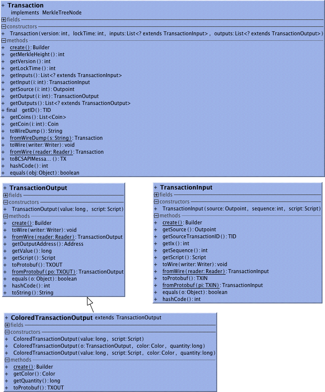
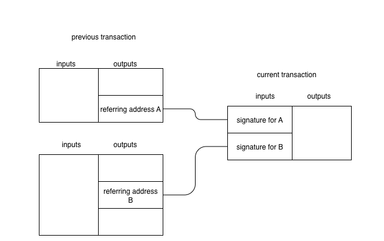

A Transaction spend some output of previous transactions and produces new outputs. 
One of the transaction's (many) validity rules is that its input must not have been consumed by an other transaction, as that was a double spend.
The transaction is allowed to spend a previous output if it is able to satisfy the requirements formulated in the referred output. The most common condition is to provide a digital signature of the new transaction in the linked input script. The signature has to use the public key that corresponds to the address referred in the consumed output.

