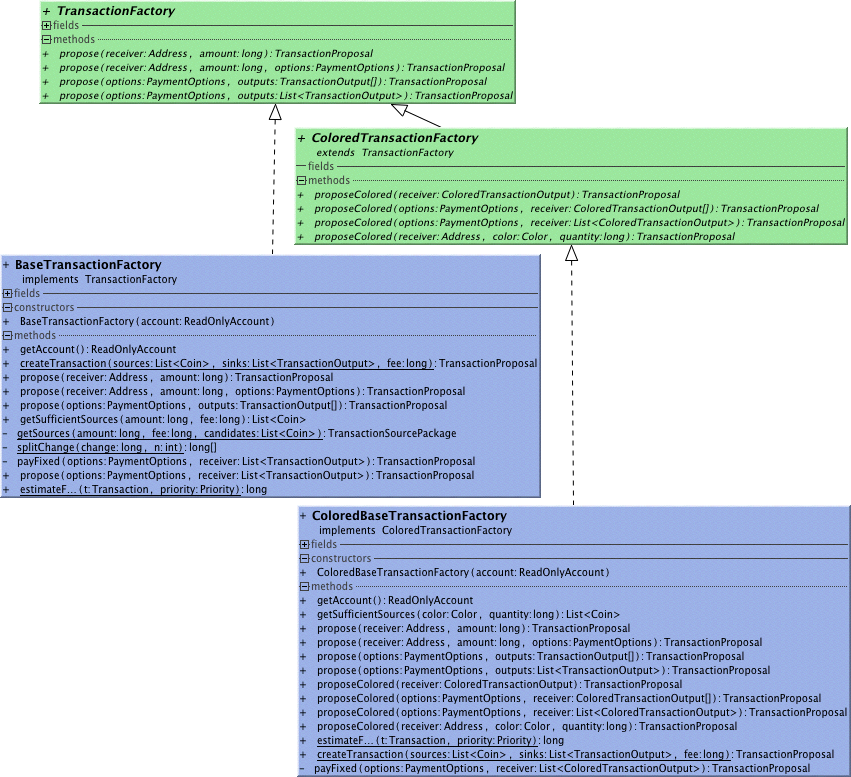

## Transaction factory
A Transaction Factory allows you to construct transactions that spend content of an Account. 
Obtain a transaction factory from an Account with its createTransactionFactory() method.
###Basic use
```
TransactionFactory factory = account.createTransactionFactory();

Transaction tx = factory.propose(receiverAddress, 30000).sign(account);
api.sendTransaction(tx);
```